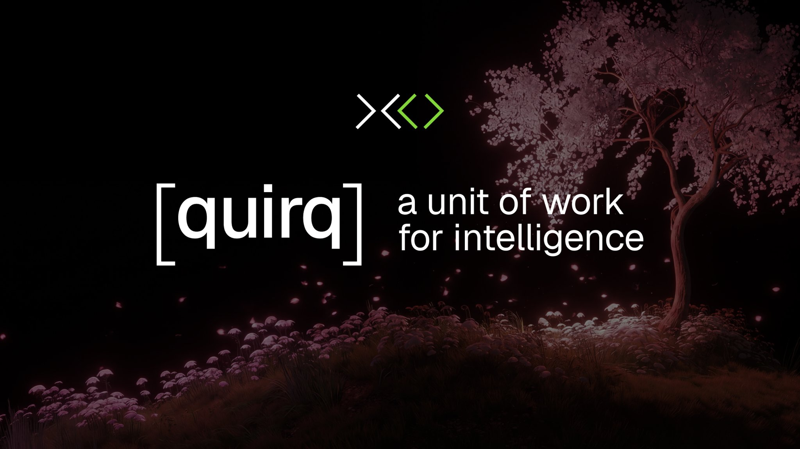

<p align="center">
  
</p>

<h1 align="center">XO&nbsp;·&nbsp;Web</h1>

<p align="center">
  <strong>Environments for AI agents.</strong><br />
  The XO marketing site and the interactive home of the <em>quirq</em> whitepaper,
  <em>a unit of work for intelligence</em>.
</p>

<p align="center">
  
  
  
  
  
  
</p>

---

## Overview

This repository is the public web presence for **XO**, the platform for building and
shipping AI agents in isolated, measurable environments. Beyond a marketing landing page,
it hosts a first-class reading and exploration experience for the **quirq** whitepaper:
one paper, presented two ways, for its two readers.

- **Humans** read the paper in the site's earth: green light, a living DNA helix, and the
  PDF rendered in the browser.
- **Machines** read the same paper as a galaxy: an interactive 3D field of tokens in
  indigo space, with the plain-text and vector companions ready to ingest.

Every claim in the paper is tiered (sourced, derived, measured, open) and backed by a
public validation lab built into the site.

## Highlights

| Surface | What it is |
| --- | --- |
| **Landing** | Full-viewport hero, the unit-of-work thesis, an interactive impact calculator, and partner proof. |
| **Whitepaper** (`/whitepaper`) | A dual human / AI reading experience with a themed transition between the two worlds. |
| **Token galaxy** (`/whitepaper/ai`) | Every meaningful term rendered as a star in a real 3D vector sky; drag to orbit, click a star to inspect a token. |
| **Visualize** (`/whitepaper/visualize`) | The paper's formulas as a live instrument: the quirq calculator, the minting lifecycle, and the quarterly ledger. |
| **Validate** (`/whitepaper/validate`) | The validation program: reproduce the paper's arithmetic against a content-addressed receipts ledger. |
| **Blog** (`/blog`) | Partner journeys and customer chapters. |

## Machine-readable companions

The whitepaper ships alongside stable, canonical files meant to be fed directly to a model
or agent:

| File | Purpose |
| --- | --- |
| [`public/whitepaper/llm.txt`](public/whitepaper/llm.txt) | The whole paper as one plain-text document, prepared for language models. |
| [`public/whitepaper/vectors.json`](public/whitepaper/vectors.json) | Every term with its real count and a vector embedding: the data the token galaxy runs on. |
| [`public/whitepaper/qq.pdf`](public/whitepaper/qq.pdf) | The canonical, typeset paper. |

> Canonical URL: `https://xo.builders/whitepaper` · text and vectors track the paper across versions.

## Tech stack

- **[Next.js 16](https://nextjs.org/)** App Router · **React 19** · **TypeScript**
- **[Tailwind CSS 4](https://tailwindcss.com/)** with shadcn/ui (Radix primitives)
- **[three.js](https://threejs.org/)** via **[@react-three/fiber](https://docs.pmnd.rs/react-three-fiber)** for the 3D visualizations
- **[lucide-react](https://lucide.dev/)** icons · **[Recharts](https://recharts.org/)** · **[Zod](https://zod.dev/)**
- **[Vercel Analytics](https://vercel.com/analytics)**

## Getting started

### Prerequisites

- **Node.js 20+**
- **[pnpm](https://pnpm.io/)** (the lockfile is `pnpm-lock.yaml`)

### Install & run

```bash
pnpm install
pnpm dev
```

Open **[http://localhost:3000](http://localhost:3000)**.

No environment variables are required for local development. The hero background video is
served from the Vercel Blob CDN.

### Scripts

```bash
pnpm dev      # start the dev server (Turbopack)
pnpm build    # production build
pnpm start    # serve the production build (run build first)
pnpm lint     # ESLint
```

## Project structure

```text
app/
  page.tsx                 # landing page
  whitepaper/              # the paper: dual view, galaxy, visualize, validate, download
  blog/                    # blog index + partner journeys
  api/validate/            # validation-lab endpoints
components/
  landing/                 # landing page sections + shared nav/footer
  whitepaper/              # the quirq experience (galaxy, calculator, validation lab)
  ui/                      # shadcn/ui primitives
lib/                       # data + helpers (quirq data, tokens, pdf paths)
public/
  images/                  # brand art, app screenshots, quirq-cover.jpg
  whitepaper/              # llm.txt, vectors.json, qq.pdf
```

## Routes

| Path | Description |
| --- | --- |
| `/` | Landing page |
| `/whitepaper` | The paper, read as a human or as a machine |
| `/whitepaper/ai` | The token galaxy (3D) |
| `/whitepaper/visualize` | The quirq calculator and 3D instruments |
| `/whitepaper/validate` | The validation lab |
| `/whitepaper/download` | Streams the canonical PDF as an attachment |
| `/blog` · `/blog/[partner]` · `/blog/post/[slug]` | Blog and partner journeys |

## Deployment

Optimized for **[Vercel](https://vercel.com/)** (zero-config Next.js). Any Node 20+ host
works: run `pnpm build`, then `pnpm start`.

## Brand

`#83d63a` is XO lime green. The mark is two pairs of chevrons forming an "XO": outer pair
white, inner pair lime. Display type is Instrument Serif; labels use JetBrains Mono.

---

<p align="center">
  <sub>© XO Labs. The <em>quirq</em> whitepaper is authored by Suraj Sharma, XO Labs.</sub>
</p>
