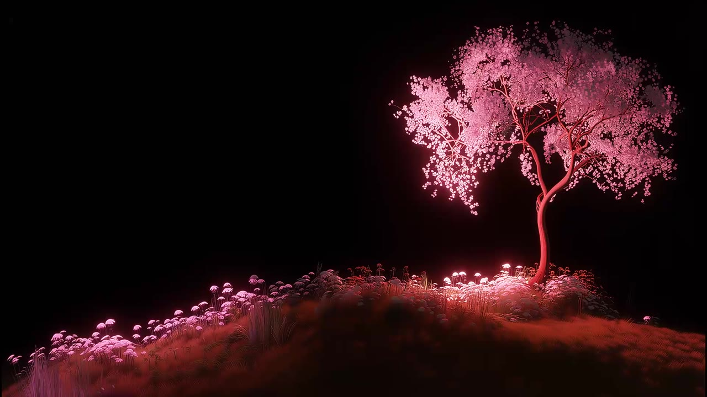
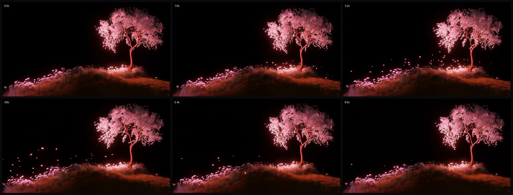

# Hero Background Video

Documentation for the looping video that plays behind the landing-page hero.

Rendered by [`components/landing/hero-section.tsx`](../components/landing/hero-section.tsx).



## At a glance

| Property | Value |
|---|---|
| Purpose | Decorative, full-bleed background behind the hero headline |
| Source | Remote (Vercel Blob), not bundled in `public/` |
| Container | MP4 (ISO 14496-14, `mp42`) |
| Video codec | H.264 / AVC, Main profile, `avc1` |
| Resolution | 1920 x 1080 (16:9), square pixels (1:1 PAR) |
| Frame rate | 24 fps, progressive |
| Duration | 8.00 s, 192 frames, seamless loop |
| Color | yuv420p, BT.709 |
| Video bitrate | ~3063 kb/s |
| Audio | AAC LC, 48 kHz, stereo, ~188 kb/s (muted in page) |
| File size | 3.31 MB (~3313 kb/s total) |
| Authoring | Adobe Media Encoder 2025.0 (macOS), MainConcept encoder |

## Source URL

```
https://hebbkx1anhila5yf.public.blob.vercel-storage.com/bg-hero-0BnFGdr81Ifnj3WbBZoNt1KE4D5DMT.mp4
```

This is a Vercel Blob asset (the `*.public.blob.vercel-storage.com` host is what v0 / Vercel Blob uploads produce). The file is referenced by absolute URL and is **not** present in this repo's `public/` directory, so the hero depends on that external host at runtime.

## What is on screen

A 3D-rendered (CGI) nighttime scene, not live footage:

- A single glowing pink cherry-blossom tree stands on the right, rooted on a low grassy mound.
- The sky is pure black; the tree, blossoms, and scattered ground flowers are bioluminescent in magenta / rose / pink tones.
- Luminous petals and particles drift across the hill.

The frame is composed with the subject on the **right** and negative space on the **left**, which is deliberate: the hero text sits in the left ~55% of the screen, over the darkest part of the image.

The palette is almost entirely black with warm pink highlights (average frame color is roughly `rgb(42,18,19)`). Note it does **not** use the XO brand lime green (`#83d63a`); the only green-adjacent brand cue in the hero is in the animated `BlurWord` text, not the video.

### Motion / loop

The camera is essentially static. The animation is the drifting petals:

| Time | State |
|---|---|
| 0.0 s | Calm, petals settled, tree glowing |
| 1.6 s | Petals begin lifting off the hillside |
| 3.2 s | Peak: petals stream and swirl leftward across the hill (brightest scatter) |
| 4.8 s | Settling |
| 6.4 s | Mostly settled, a few stragglers drifting left |
| 8.0 s | Calm again, matches the first frame |



The first and last frames differ by only ~2.4% mean pixel value, confirming the clip is authored as a **seamless 8-second loop** (no visible jump at the wrap point).

## How it is used in code

In `hero-section.tsx`, inside a `z-0` absolute layer:

```tsx
<video
  autoPlay
  muted
  loop
  playsInline
  aria-hidden="true"
  className="w-full h-full object-cover object-center opacity-80"
>
  <source src="https://hebbkx1anhila5yf.public.blob.vercel-storage.com/bg-hero-0BnFGdr81Ifnj3WbBZoNt1KE4D5DMT.mp4" type="video/mp4" />
</video>
```

Key points:

- **`autoPlay muted loop playsInline`** is the standard combination for an autoplaying background video. Browsers only allow autoplay when the video is muted, and `playsInline` stops iOS Safari from forcing fullscreen playback. The clip has an audio track but it is silenced here.
- **`aria-hidden="true"`** correctly hides this decorative element from assistive tech.
- **`object-cover object-center`** crops the 16:9 video to fill any viewport, anchored to center. On tall/narrow viewports the left and right edges get cropped.
- **`opacity-80`** dims the video to 80%.
- Two gradient overlays sit on top for text legibility:
  - `bg-gradient-to-r from-black/70 via-black/30 to-transparent` darkens the left side where the headline lives.
  - `bg-gradient-to-b from-black/20 via-transparent to-black/60` adds a top-and-bottom vignette.
- Layer order: video `z-0`, decorative grid lines `z-[2]`, hero content `z-10`, bottom stats `absolute bottom-12`.

There is no `poster`, no `preload` hint, and no local fallback `<source>`.

## Known limitations / recommendations

These are optional improvements, not bugs:

1. **External dependency.** The video loads from a Vercel Blob URL. If that asset is deleted or the host is unreachable, the hero shows a black background (acceptable, since the overlays and black `bg-black` already assume darkness). To make the page self-contained, download the file into `public/` and reference it as `/bg-hero.mp4`.
2. **No `poster` image.** Before the video buffers, the area is black. Adding `poster="/images/hero-video-poster.jpg"` (a still is saved at [`docs/assets/hero-video-poster.jpg`](assets/hero-video-poster.jpg)) would show the first frame immediately and remove any flash.
3. **Audio track is dead weight.** The video is always muted, but it still ships a ~188 kb/s stereo AAC track. Re-encoding without audio (`-an`) would shave file size with zero visual change.
4. **Single resolution.** A 1080p, ~3.3 MB file is served to phones too. A smaller mobile variant plus `media`-scoped `<source>` elements (or a lighter re-encode) would cut mobile data use.
5. **No reduced-motion handling.** Consider pausing or hiding the video under `@media (prefers-reduced-motion: reduce)` for motion-sensitive users.

## Reproducing the metadata

The figures above were read directly from the file. With ffmpeg/ffprobe:

```bash
ffprobe -hide_banner bg-hero.mp4          # streams, codecs, duration, bitrate
ffmpeg -ss 3.2 -i bg-hero.mp4 -frames:v 1 frame.png   # grab a frame
```

Authoring details (Adobe Media Encoder 2025.0, MainConcept codec, 24 fps progressive, stereo 48 kHz) come from the embedded Adobe XMP packet (`uuid` box) and the MP4 `moov` handler strings.
